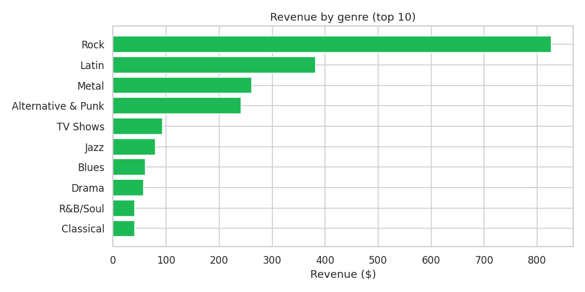
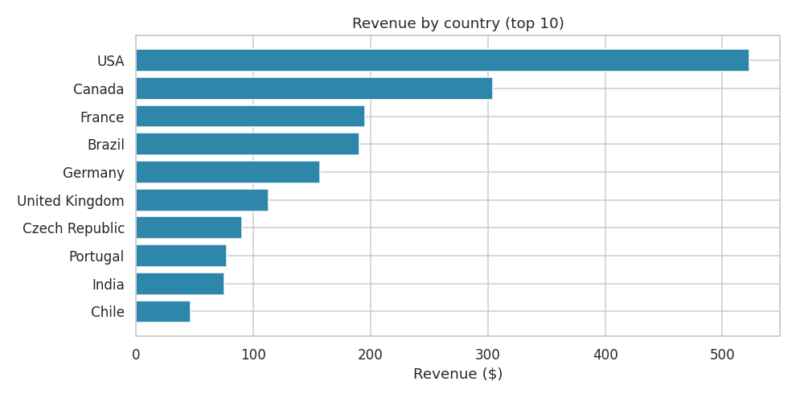
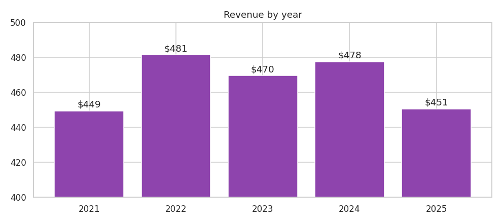

# 🎵 Chinook Music Store: SQL Business Analysis

  

This project answers **15 business questions** for a digital music store (like an early iTunes) using SQL, from overall KPIs to customer value, sales-agent performance, genre preferences by country, and the health of the catalogue.

## 📊 Dataset
- **[Chinook database](https://github.com/lerocha/chinook-database)**, an open sample DB modelling a digital media store
- 11 related tables: `Customer`, `Invoice`, `InvoiceLine`, `Track`, `Album`, `Artist`, `Genre`, `MediaType`, `Employee`, `Playlist`, `PlaylistTrack`
- 412 invoices · 59 customers · 24 countries · 3,503 tracks

## 🧠 SQL concepts used
`INNER/LEFT JOIN` (up to 4 tables) · `GROUP BY / HAVING` · **CTEs** · **window functions** (`RANK`, `ROW_NUMBER`, `LAG`, `SUM() OVER`) · `CASE` · correlated subqueries · date functions · pivoting with conditional aggregation

## ❓ Business questions answered
| # | Question | Key technique |
|---|---|---|
| 1 | Overall KPIs (orders, customers, revenue, AOV) | Aggregates |
| 2 | Revenue by year and YoY growth | CTE + `LAG` |
| 3 | Top countries by revenue and share | Subquery |
| 4 | Best-selling genres | 3-table join |
| 5 | Top artists by revenue | 4-table join |
| 6 | Top customers by lifetime value and their rep | 3-table join |
| 7 | Sales-agent performance ranking | `RANK()` |
| 8 | Most popular genre per country | `ROW_NUMBER()` partition |
| 9 | Monthly revenue with running total | `SUM() OVER` |
| 10 | Customer segmentation by value | `CASE` + CTE |
| 11 | Media-type share | Subquery % |
| 12 | Tracks never sold | `LEFT JOIN` anti-pattern |
| 13 | Full-album vs single-track purchases | Multi-CTE |
| 14 | Quarterly revenue pivot | Conditional aggregation |
| 15 | Customers beating their country's average | Correlated subquery |

➡️ **All queries:** [`sql/analysis_queries.sql`](sql/analysis_queries.sql) · **All outputs:** [`results.md`](results.md)

## 📈 Visuals
| Revenue by genre | Revenue by country |
|---|---|
|  |  |



## 💡 Key insights
- **$2,328.60 total revenue** from 412 orders; the average order is small at **$5.65**, typical of per-track pricing.
- **USA (22.5%) and Canada (13.1%)** bring in over a third of revenue. **Rock is the #1 genre in every one of the top 10 countries.**
- **Rock alone brings in $826.65 (35%)** of revenue; Iron Maiden, U2 and Metallica are the top artists.
- **Jane Peacock** is the top sales agent ($833 from 21 customers).
- **43% of the catalogue (1,519 tracks) has never sold**, a clear opportunity to promote or prune.
- **96% of purchases are individual tracks**, not full albums. Album bundles or discounts could raise order value.
- Revenue is **flat at about $450–$480 a year**, so growth needs new markets or higher order values rather than the existing base.

## ▶️ How to run
```bash
sqlite3 data/chinook.sqlite < sql/analysis_queries.sql
```
Or open `data/chinook.sqlite` in **DB Browser for SQLite** / DBeaver and run each query.

---
👤 **Ansh Rai**, Data Analyst · [LinkedIn](https://www.linkedin.com/in/anshrai-adr) · [GitHub](https://github.com/ANSHRAI21) · [Portfolio](https://a-s-pyratech-solutions.space)
